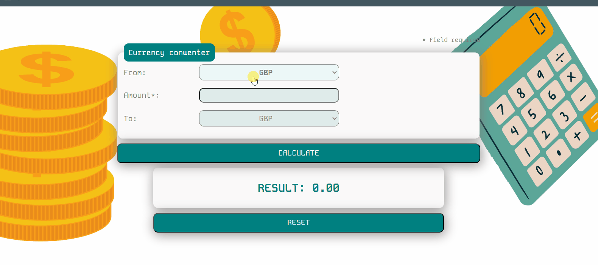

# CURRENCY CALCULATOR

https://katarzynamaculewicz.github.io/Currency-calculator/

## Demo

## Description

This repository contains a simple currency calculator. The website lets users convert popular world currencies such as GBP, EUR, USD, and PLN. The interface is easy to use and intuitive.

## Technologies

- HTML
- CSS
- JavaScript
- BEM convenion
- ES6 + features
